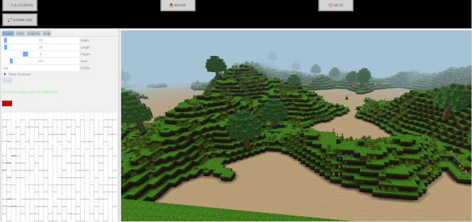

[](https://app.netlify.com/sites/jade-semifreddo-f24ef0/deploys?branch=main)

# maze-builder-frontend

Provides the Maze Builder application with a web interface.



Deployed on [Netlify](https://jade-semifreddo-f24ef0.netlify.app/) - distributed securely using `netlify.toml`:
```toml
[[headers]]
  for = "/*"
  [headers.values]
    Cross-Origin-Opener-Policy = "same-origin"
    Cross-Origin-Embedder-Policy = "require-corp"
```

## Build and Run

JavaScript glue code and files are generated using [Emscripten](https://emscripten.org/index.html) and [https://github.com/zmertens/MazeBuilder?tab=readme-ov-file#cmake](https://github.com/zmertens/MazeBuilder?tab=readme-ov-file#cmake).

In order to spin up the frontend with [Vite](https://vitejs.dev/), the WebAssembly modules must be compiled:
1. Generate JavaScript and WebAssembly files from [MazeBuilder's C++ codebase](https://github.com/zmertens/MazeBuilder). This is done with Emscripten and CMake.
   - Please note that there are different performances and compiler optimizations between the Release and Debug build configurations.
2. Move these generated files from the C++ repo to this repo:
     - `maze_builder.js` under `src/`
    - `maze_builder.wasm` under `src/`
    - `maze_builder.wasm.map` under `src/`
    - `maze_builder.data` under `/public`
    
3. From the root of this repo, run `npm i` and then `npm run dev` , this will cause Vite to spin up a local server.
     - Open a browser with the specified port. For example, `localhost:5173`
